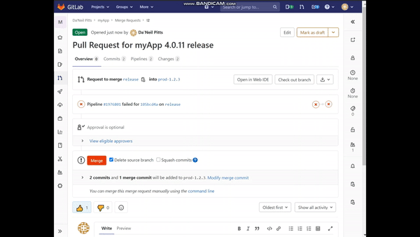

# Frequently Asked Questions
 
- [Getting Started](getting-started.md)
- [What is description.toml?](file-breakdown.md#packagetoml)
- [What is package.toml?](file-breakdown.md#packagetoml)
- [What is launcher.toml?](launcher.md)
- [What is requirements.toml?](file-breakdown.md#requirementstoml)
- [How do I set Feature Image](#publishupdate-featured-image)
- [How to broadcast release multi-platform](#broadcast-release-updates)
- [How to EDIT published release](#edit-text-fields-of-release-without-updating-version)
- [How to DELETE published release](#deleting-entry-in-database)
- [Why did my pipeline FAIL](#pipeline-failed)
- [My pipeline has a WARNING](#pipeline-warning)
- [My new release is not showing](#version-not-showing-in-launcher-or-pipeline-version-not-latest)
- [Version string is invalid](#invalid-semantic-versioning)
- [Difference between Production & Integ](#pipeline-warning)
- [Thick package vs Thin package](thin-vs-thick.md)
- [How to set release as BETA](#set-release-as-beta)
- [What is externalHyperlink](#have-your-launcher-app-link-out-to-external-resource)
- [What is a pipeline?](https://docs.gitlab.com/ee/ci/pipelines/)

#### Have your Launcher app link out to external resource
 - Rather than uploading packages to Launcher, you can provide url/links to an external resource.
 - Set `externalHyperlink = true` in [package.toml](package.toml)
 - Once set, `url` in the package object is treated as the links to the external resource.
    - Example
      - The below will link your `windows-x86_64` app to "https://www.nvidia.com/en-us/".
      ```
      [[package.windows-x86_64.packman]]
      name = "package1"
      url = "https://www.nvidia.com/en-us/"
      location = "${base}"

      ```
#### Set Release as BETA
 - Add `beta` as a `tag` in [description.toml](description.toml)
    - Example
      ```
      tags = [
        'construction',
        'engineering',
        'beta'
      ]
      ```
 - Note that as of September 15, 2021 changing the beta tag with the "edit-text" mode does not cause the `Beta` tag to display in the version in the Launcher.

#### Publish/Update Featured image
 - Add a `feature.png` images.zip in the [package.toml images zip](package.toml#L36).
 - `feature.png` is required to be *175x273px*
 - Note the images.zip should contain a `icon.png`, `image.png`, `feature.png`, and `background.png`
 - If a `feature.png` is **not provided**. A default image will be used. 
 
#### Broadcast release updates  
 - Post messages on release to Jira, Slack, Email, [forums.developer.nvidia](https://forums.developer.nvidia.com/), and Text Message 
 - Requires a [message.toml](message.toml)
 - By **default** the message will contain contains of CHANGELOG.md
 - Alternatively, you post **custom messages** and override the CHANGELOG.md by adding `override_message = "my custom message"` to your message.toml
    - Allowing for a custom message
  - Ex: `override_message = "OM-27478 Support camera control on multiple viewports. (Jihui Shentu)"`
###### Post change updates to Jira  
  - Update Jira Issues once fixes are published
    - Ex: I'm publishing a release that resolves Jira Issue [OM-23030](https://nvidia-omniverse.atlassian.net/browse/OM-23030).
  - To update, add jira array to [message.toml](message.toml)
    - for one:  `jira = ["OM-26226"]`
    - for multiple: `jira = ["OM-26226", "OM-26227"]`
###### Post change updates to Forums    
  - Update [Forums](https://forums.developer.nvidia.com/c/omniverse/300) once fixes are published
    - Ex: I'm publishing a release that resolves Forum [Omniverse-Drive-Installing-Frozen-When-Register-169647](https://forums.developer.nvidia.com/t/omniverse-drive-installing-frozen-when-register/169647).
  - To update, add forum array to [message.toml](message.toml)
    - you only need to provide the id of the Forums Post
      - In our example its [16947](https://forums.developer.nvidia.com/t/omniverse-drive-installing-frozen-when-register/169647)
    - for one:  `forums = ["169647"]`
    - for multiple: `forums = ["169647", "169648"]`
###### Post change updates Email 
  - Ex: I want to email client after publishing change.
  - ** Emails will be sent to shared-pipeline-myapp@nvidia.com ** 
    - This email is a nvidia dl
  - You can request to add emails to dl via [gitlab issue](https://gitlab-master.nvidia.com/omni-cd/toml-database/-/issues/new?issue%5Bassignee_id%5D=&issue%5Bmilestone_id%5D=) 
  - To do, set email value to true in [message.toml](message.toml)
    - Ex: `email = true`
###### Post change updates via Text Message
  - Ex: I want to text client after publishing change.
  - To do, add sms array to [message.toml](message.toml)
    - _**include country code in number (EX: US is `1`)**_
    - for one:  `text = ["14001234000"]`
    - for multiple: `text = ["14001234000", "14001234030" ]`
#### Ignore latest error on release.
  - By default, the pipeline blocks releases to versions less than or equal to latest entire in launcher.
  - You can override this by adding `mode = "ignore-latest"` to top line in description.toml.
    - Afterward run your pipeline as normal.
    - Example of modified description.toml
      ```
      mode = "ignore-latest"
      #displayed application name
      name = 'myApp'
      #displayed application name in smaller card and library view
      shortName = 'myApp'
      version = '4.0.1'
      #boolean for if this version is the latest version
      latest = true

      ```
#### Edit text fields of release without updating version
  - You can edit the below text fields for an existing Launcher Entry.
    - `shortName`
    - `productArea`
    - `category`
    - `tags`
    - `description`
    - `links`
  - To update, you must add `mode = "edit-text"` to top line in description.toml.
    - Afterward run your pipeline as normal.
    - Example of modified description.toml
      ```
      mode = "edit-text"
      #displayed application name
      name = 'myApp'
      #displayed application name in smaller card and library view
      shortName = 'myApp'
      version = '4.0.1'
      #boolean for if this version is the latest version
      latest = true

      ```
#### Deleting entry in database
  - You can remove entries in database based on slug and version.
    - I want to remove version `100.2.1` of slug `maya-connector`.
  - To remove, run pipeline with _**negative**_ version number in description and package toml.
    - In our example, you would set version to `-100.2.1` to delete.
      ```
      #displayed application name
      name = 'maya'
      #displayed application name in smaller card and library view
      shortName = 'maya'
      version = '-100.2.1'
      ```
## Pipeline FAILED
#### Required Jira issue
  - Each push to production will require a Jira Issue being Approved.
    - The initial run of the pipeline will create a Jira Issue and end with a failed status. The pipeline log will include a link to the Jira Issue.
  - Once, the Jira Issue is approved. Jira will Trigger  deployment to Production via Shared Pipeline. 
    - Note, you can see results via pipeline history of the repo.
    

#### Failed Child Pipeline / Downstream
  - This pipeline will fail if you do not have a [`CHANGELOG.MD`](CHANGELOG.md).
  - The purpose of the child pipeline is send out communications via jira, slack, email, or text regarding your release. [See documentation on Posting Release Updates](#broadcast-release-updates)
#### Invalid Semantic Versioning
  - Pipeline will fail if the version value in your toml files is not validate semantic.
  - Valid examples  
    - 0.0.0
    - 0.0.0-rc.1
  - Invalid examples  
    - 0.0
    - 0.0-rc.1
  - [Reference issue](https://gitlab-master.nvidia.com/omni-cd/toml-database/-/issues/1)

#### Valid Users (WIP)
 - Only repo Maintainers and Owners can publish to production.
 - Pipeline will fail when user triggers pipeline without required privileges. 
#### Valid Repo (WIP)
  - Pushes to database will fail if from invalid repo.
  - Full example
    - Repo `maya-connector-release-pipeline` pushes to shared pipeline with a slug of `maya-connector`
    - Now only repo `maya-connector-release-pipeline` can push to shared pipeline with the slug  `maya-connector`.
      - A push from another repo will **fail** the shared pipeline.
## Pipeline WARNING
  - When you publish without a [CHANGELOG.md](file-breakdown.md#changelogmd)
  - When you publish without a [requirements.toml](file-breakdown.md#requirementstoml)
#### Version not showing in Launcher or Pipeline version not latest
  - Check the `version` of your last push (in tomls).
  - Ensure your `version` TRULY is the latest.
  - Avoid incrementing `version` with letters.
    - This is because it may not be intiutive what is larger.
    - EX: 100.1.0-rc.9b > 100.1.0-rc.10b  
  - [Reference issue](https://nvidia-omniverse.atlassian.net/browse/OM-23548)

## Difference between Production & Integ
## Helpful Links
[Tool to Validate Semantic Version](https://omniverse.gitlab-master-pages.nvidia.com/launcher-compare-versions/)


    
