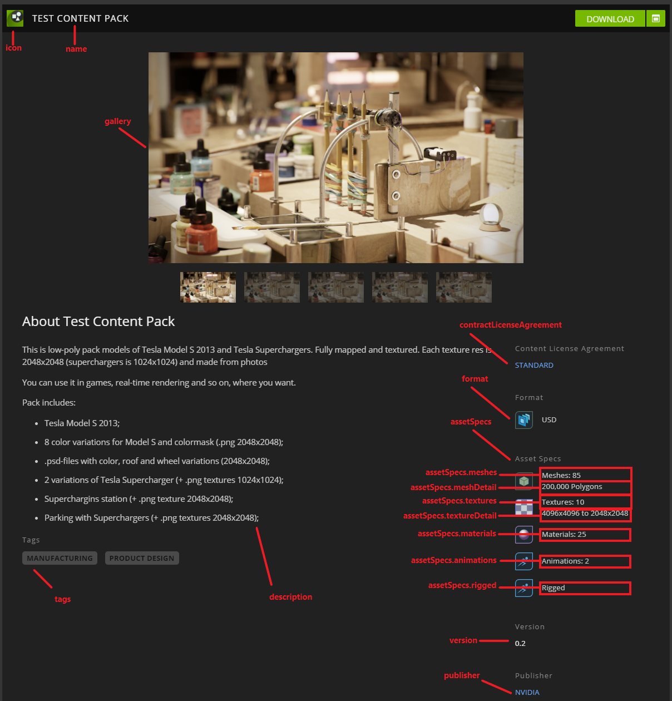

# Breakdown required fields for `content-pack` `kind`

### gallery 
- array of images used for content gallery. 

### format
- the format of the content pack.
- examples "usd | mdl | img | animations | mixed"

### extensionDependencies 
- arrray which defines what dependencies must be installed if this content is an extension

### contractLicenseAgreement
- Agreement information with link

### assetSpecs
- Specifications for this content: the number of meshes, textures, materials for this content.

### meshes
- represents the number of meshes for this content
### meshDetail
- defines the short description for meshes
### textures
- represents the number of textures for this content
### textureDetail
- defines the short description for textures
### materials
- represents the number of materials for this content
### animations
- represents the number of animations for this content
### rigged

## How the toml attributes are displayed:

