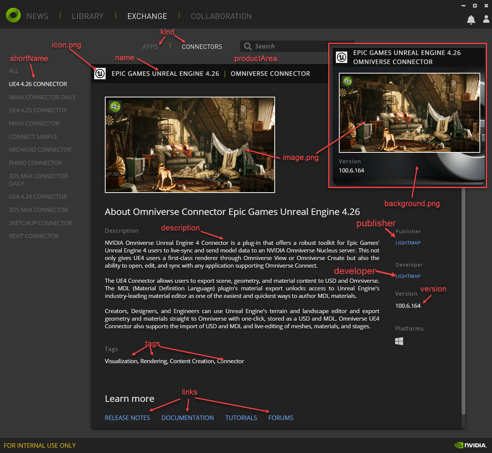
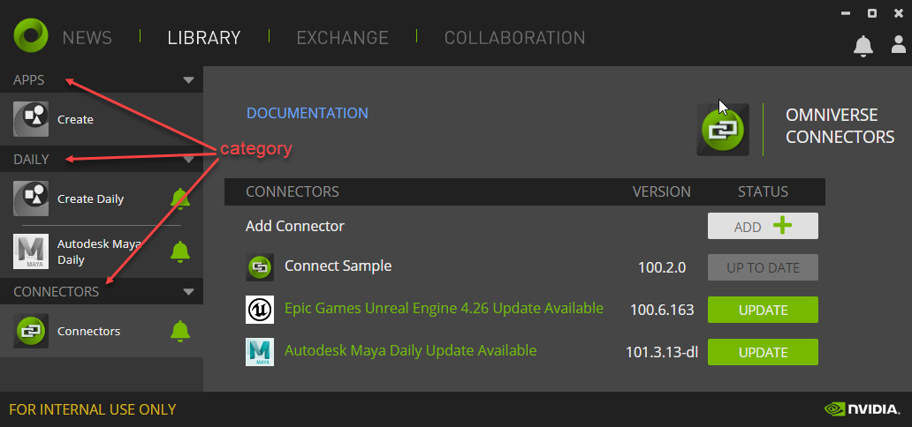

# Breakdown of toml attributes

### name
   - displayed application name

### shortName
   - displayed application name in smaller card and library view

### version
   - version of application

### slug
   - unique identifier for component, all lower case, persists between versions

### productArea
   - displayed before application name in launcher

### category
   - category of content
   - value one of ["File Management", "Connectors", "Apps", "Experiences", "Extensions"]

### tags
   - values in array
   - values for filtering content, not implemented yet

### kind
   - the kind of your application
   - value one of ["collaboration", "connector", "app", "experience", "extension"]

### description
   - values in array
   - description of application
   - each line is a new line, keep lines under 256 char and keep lines under 4

### links
   - is an array map
   - map is of `title` and `url`
   - title  
    - title of link
   - url  
    - url to link

### package.*
   - is an array map
   - map is of `name`, `url`, and `location`
   - name  
    - name of package
   - url  
    - url to package
   - location  
    - location the package needs to downloaded to  
    - start with `${base}`

### images
   - object with url to image.zip
   - zip of `icon.png`, `image.png`, and `background.png`
   - name  
    - name of image.zip
   - url  
    - url to download image zip

### showInLibrary
   - boolean
   - show this in the library, default is true

### defaults.*
   - install and launch instructions by environment

## How the toml attributes are displayed:

