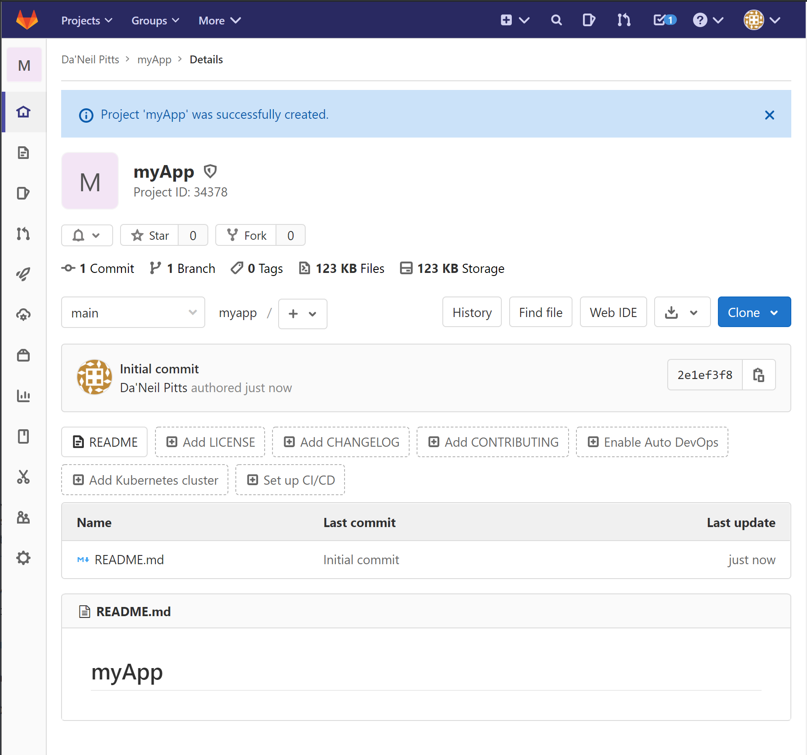
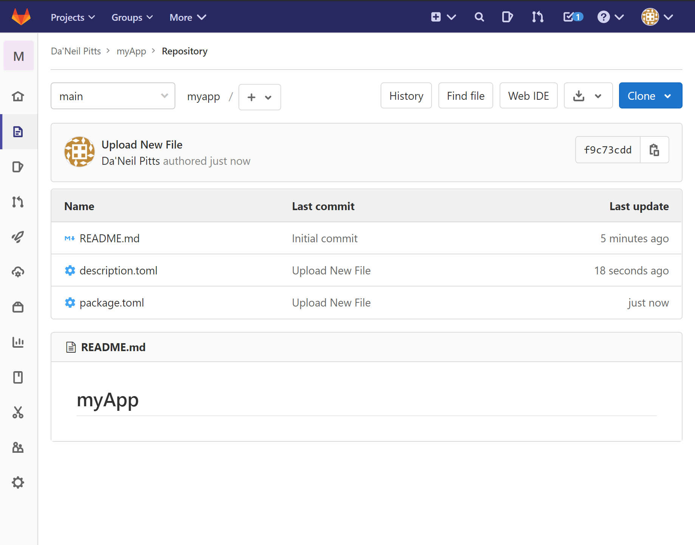
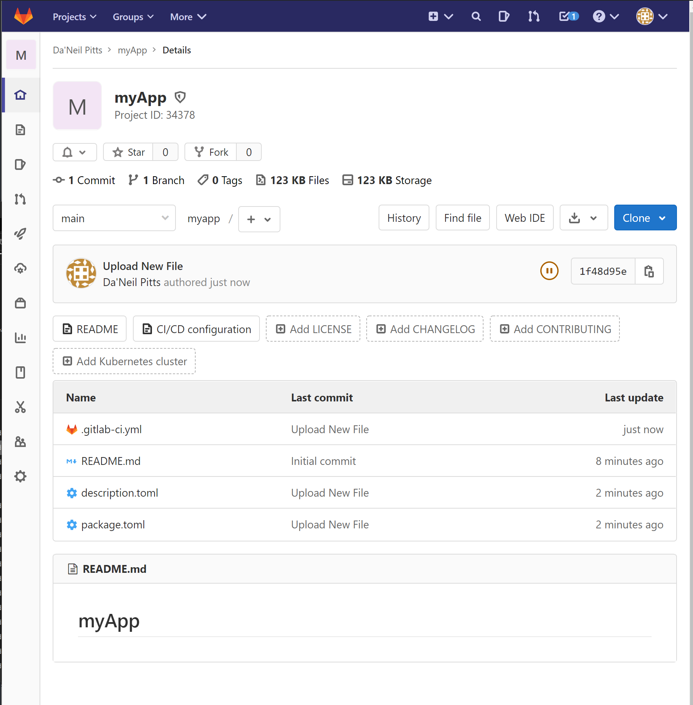
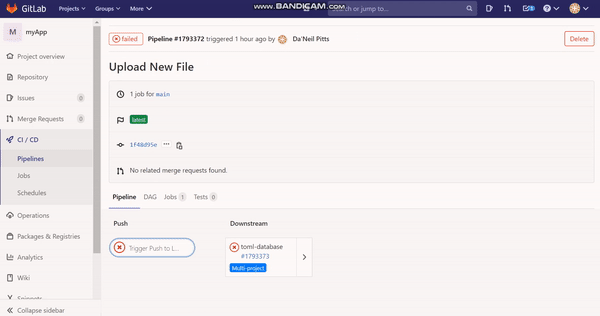

# Overview
Deployments to Omiverse Launcher are handled via pipelines.  
  - [What is a pipeline](https://docs.gitlab.com/ee/ci/pipelines/)  

To setup pipeline add template files to your repository, then update the templates with your application specifics. 
### Prerequisites
- [Set deployment enviornment](enviroment.md)
- `description.toml`
- `package.toml`
-  Optional:  
    - `CHANGELOG.md`
    - `requirements.toml`
    - `message.toml`
###### [Click here for detail breakdown of each file](file-breakdown.md)
_The prerequisites files are placed at the **root (/)** of your repository._

## Getting Started
1. Locate or create repository where pipeline is desired
    - Example: https://gitlab-master.nvidia.com/dpitts/myapp  

2. Copy [`description.toml`](description.toml) & [`package.toml`](package.toml) templates to the **root (/)** of your repo.

3. Update [`description.toml`](description.toml) & [`package.toml`](package.toml) with your app information.
    - This is filling in information like `name` and `links` to product information.
      - [Click here for detail breakdown of each file](file-breakdown.md)
    - Once complete, validate your toml file.
       - Can use [this tool](https://www.toml-lint.com/)
    - Validate urls used in tomls!

4. Copy [`.gitlab-ci.yml`](.gitlab-ci.yml) to the **root (/)** of your repo.
      - By **default**, there is nothing to change in `.gitlab-ci.yml`
      - Optionally in `.gitlab-ci.yml`, you can change the path to `description.toml` and `package.toml`

      
5. Your done, from this point, the pipeline will run on every commit.

## Understanding the Pipeline 
- You can see running & ran pipelines by going to your_repo_url `/-/pipelines`
    - Example: https://gitlab-master.nvidia.com/dpitts/myapp/-/pipelines

- Here you can see status. Click on the status to see the pipeline output.

# [Frequently Asked Questions](FAQ.md)

